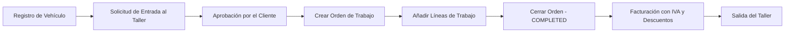

# CarLog — Plataforma de Gestión Integral de Talleres Mecánicos


---

## Descripción

**CarLog** es una plataforma **Full Stack** para la gestión integral de talleres mecánicos. Proporciona una arquitectura RESTful robusta y escalable que cubre el ciclo de vida completo de un vehículo: desde su entrada al taller y la creación de órdenes de trabajo, hasta la facturación final y la salida.

El sistema está diseñado para dar soporte a múltiples roles de usuario, garantizando una experiencia adaptada a cada actor del ecosistema de reparación automotriz.

---

## Tabla de Contenidos

- [Características Principales](#características-principales)
- [Stack Tecnológico](#stack-tecnológico)
- [Arquitectura del Sistema](#arquitectura-del-sistema)
- [Modelos de Dominio](#modelos-de-dominio)
- [Roles del Sistema](#roles-del-sistema)
- [Seguridad y Autenticación](#seguridad-y-autenticación)
- [API REST — Referencia de Endpoints](#api-rest--referencia-de-endpoints)
- [Notificaciones en Tiempo Real](#notificaciones-en-tiempo-real)
- [Manejo de Errores](#manejo-de-errores)
- [Estructura del Proyecto](#estructura-del-proyecto)
- [Inicio Rápido](#inicio-rápido)
- [Configuración](#configuración)
- [Flujo de Trabajo Principal](#flujo-de-trabajo-principal)
- [Licencia](#licencia)

---

## Características Principales

- **Gestión completa de vehículos**: registro, actualización, historial de reparaciones y transferencia de propiedad.
- **Órdenes de trabajo**: ciclo de vida completo (PENDING → IN_PROGRESS → COMPLETED) con cálculo automático de totales, IVA y descuentos.
- **Protocolo de entrada/salida de taller**: handshake de doble confirmación entre propietario y taller.
- **Sistema de empleados**: flujo de invitación → aceptación/rechazo → baja laboral.
- **Notificaciones en tiempo real** vía WebSocket (STOMP) para eventos críticos del taller.
- **Autenticación stateless** con JWT y control de acceso basado en roles (RBAC).
- **Gestión de imágenes**: subida de fotos de vehículos e iconos de taller (Base64 y Multipart).
- **Manejo centralizado de errores** con respuestas JSON estandarizadas.
- **Infraestructura containerizada** con Docker Compose (MySQL + phpMyAdmin).

---

## Stack Tecnológico

| Componente       | Tecnología                        | Descripción                                      |
|------------------|-----------------------------------|--------------------------------------------------|
| **Backend**      | Java 21 / Spring Boot 4.0.1       | Framework principal de la aplicación             |
| **Base de Datos**| MySQL 8.0                         | Almacenamiento relacional persistente            |
| **ORM**          | Spring Data JPA / Hibernate       | Mapeo objeto-relacional y gestión de esquema     |
| **Seguridad**    | Spring Security + JJWT            | Autenticación stateless y RBAC                   |
| **Tiempo Real**  | WebSocket (STOMP)                 | Notificaciones push para eventos del taller      |
| **Despliegue**   | Docker & Docker Compose           | Orquestación de infraestructura                  |
| **Utilidades**   | Lombok                            | Reducción de código boilerplate                  |
| **Admin BD**     | phpMyAdmin                        | Interfaz visual de gestión de base de datos      |

---

## Arquitectura del Sistema

CarLog sigue una arquitectura en capas estándar, con separación clara de responsabilidades:

```
Cliente (Angular / Postman)
        │
        ▼
┌─────────────────────────┐
│   REST Controllers      │  ← Capa de entrada HTTP
│  (VehicleController,    │
│   WorkOrderController,  │
│   UserController, ...)  │
└────────────┬────────────┘
             │
             ▼
┌─────────────────────────┐
│    Service Layer        │  ← Lógica de negocio, validaciones,
│  (VehicleService,       │    cálculos financieros, notificaciones
│   WorkOrderService,     │
│   UserService, ...)     │
└────────────┬────────────┘
             │
             ▼
┌─────────────────────────┐
│   JPA Repositories      │  ← Acceso a datos (Spring Data JPA)
└────────────┬────────────┘
             │
             ▼
┌─────────────────────────┐
│   MySQL 8.0 (Docker)    │  ← Persistencia
└─────────────────────────┘
```

### Infraestructura Docker

```
Docker Engine
├── carlog-mysql   (MySQL 8.0)    → Puerto 3306
└── carlog-admin   (phpMyAdmin)   → Puerto 8082

Spring Boot App                   → Puerto 8081
```

---

## Modelos de Dominio

### Diagrama Entidad-Relación

```
User ──────────────< Vehicle
 │                      │
 │                      │
 └──────> Workshop ─────┘
              │
              └──────< WorkOrder ──────< WorkOrderLine
```

| Entidad          | Clave Natural | Descripción                                                  |
|------------------|---------------|--------------------------------------------------------------|
| `User`           | `dni`         | Actor principal. Implementa `UserDetails` de Spring Security |
| `Workshop`       | `workshopId`  | Entidad de negocio. Gestiona empleados y flota de vehículos  |
| `Vehicle`        | `plate`       | Activo central. Vinculado a propietario y taller actual      |
| `WorkOrder`      | `id`          | Registro de servicio. Contiene líneas de trabajo y totales   |
| `WorkOrderLine`  | `id`          | Ítem individual (pieza o mano de obra) con subtotal propio   |

---

## Roles del Sistema

| Rol         | Descripción                                                        |
|-------------|--------------------------------------------------------------------|
| `MANAGER`   | Gestión completa del taller: empleados, vehículos y órdenes        |
| `MECHANIC`  | Operaciones de reparación y diagnóstico en órdenes asignadas       |
| `CLIENT`    | Seguimiento de sus propios vehículos e historial de reparaciones   |
| `DIY`       | Entusiastas del bricolaje automotriz con acceso limitado           |

---

## Seguridad y Autenticación

El sistema utiliza un modelo de autenticación **stateless** basado en **JWT**. Cada petición debe incluir un token válido en la cabecera `Authorization`.

### Flujo de Autenticación

```
1. POST /api/auth/register   → Registro de usuario (contraseña cifrada con BCrypt)
2. POST /api/auth/authenticate → Login → Devuelve JWT + metadatos (DNI, Rol, WorkshopID)
3. Peticiones protegidas     → Authorization: Bearer <token>
```

### Rutas Públicas (sin autenticación)

| Ruta                  | Descripción                        |
|-----------------------|------------------------------------|
| `/api/auth/**`        | Registro y login                   |
| `/uploads/**`         | Servicio de archivos estáticos     |
| `/ws-carlog/**`       | Handshake WebSocket                |

### Cadena de Filtros

```
Request → JwtAuthenticationFilter → SecurityContextHolder → REST Controller
               │
               ├── Extrae token del header
               ├── Valida firma y expiración (JwtService)
               └── Carga UserDetails desde base de datos
```

---

## API REST — Referencia de Endpoints

### Autenticación (`/api/auth`)

| Método | Endpoint                    | Descripción              |
|--------|-----------------------------|--------------------------|
| `POST` | `/api/auth/register`        | Registrar nuevo usuario  |
| `POST` | `/api/auth/authenticate`    | Login y obtención de JWT |

---

### Vehículos (`/api/vehicles`)

| Método   | Endpoint                                          | Descripción                                  |
|----------|---------------------------------------------------|----------------------------------------------|
| `GET`    | `/api/vehicles`                                   | Listar vehículos (global, por taller o dueño)|
| `GET`    | `/api/vehicles/{plate}`                           | Obtener vehículo por matrícula               |
| `POST`   | `/api/vehicles`                                   | Registrar nuevo vehículo                     |
| `PUT`    | `/api/vehicles/{plate}`                           | Actualizar datos del vehículo                |
| `DELETE` | `/api/vehicles/{plate}`                           | Eliminar vehículo e imágenes                 |
| `GET`    | `/api/vehicles/search`                            | Buscar vehículos (`q`, `workshopId`, `type`) |
| `GET`    | `/api/vehicles/{plate}/history`                   | Historial de órdenes de trabajo              |
| `PUT`    | `/api/vehicles/{plate}/request-entry/{workshopId}`| Solicitar entrada al taller                  |
| `PUT`    | `/api/vehicles/{plate}/approve-entry`             | Aprobar solicitud de entrada                 |
| `PUT`    | `/api/vehicles/{plate}/reject-entry`              | Rechazar solicitud de entrada                |
| `POST`   | `/api/vehicles/{plate}/exit/{workshopId}`         | Registrar salida del taller                  |
| `POST`   | `/api/vehicles/{plate}/transfer`                  | Transferir propiedad del vehículo            |

**Tipos de búsqueda (`type`):**
- `OWNER` — Vehículos del usuario autenticado
- `ASSIGNED` — Vehículos asignados al mecánico autenticado
- `WORKSHOP` — Vehículos en el taller del usuario

---

### Órdenes de Trabajo (`/api/workorders`)

| Método   | Endpoint                                        | Descripción                                  |
|----------|-------------------------------------------------|----------------------------------------------|
| `GET`    | `/api/workorders`                               | Listar órdenes (filtro por `mechanicDni`)    |
| `GET`    | `/api/workorders/{id}`                          | Detalle de una orden                         |
| `GET`    | `/api/workorders/workshop/{id}`                 | Órdenes de un taller                         |
| `GET`    | `/api/workorders/vehicle/{plate}`               | Historial de un vehículo                     |
| `POST`   | `/api/workorders`                               | Crear nueva orden de trabajo                 |
| `PUT`    | `/api/workorders/{workOrderId}`                 | Actualizar estado o notas del mecánico       |
| `DELETE` | `/api/workorders/{id}`                          | Eliminar orden                               |
| `POST`   | `/api/workorders/{id}/lines`                    | Añadir línea de trabajo (pieza/mano de obra) |
| `PUT`    | `/api/workorders/{orderId}/lines/{lineId}`      | Actualizar línea existente                   |
| `DELETE` | `/api/workorders/{orderId}/lines/{lineId}`      | Eliminar línea                               |
| `PATCH`  | `/api/workorders/{orderId}/reassign`            | Reasignar mecánico                           |

**Estados de una orden (`WorkOrderStatus`):**

```
PENDING  ──(primera línea añadida)──►  IN_PROGRESS  ──(cierre manual)──►  COMPLETED
```

---

### Usuarios (`/api/users`)

| Método  | Endpoint                        | Descripción                                  |
|---------|---------------------------------|----------------------------------------------|
| `GET`   | `/api/users/{dni}`              | Obtener perfil de usuario                    |
| `PATCH` | `/api/users/{dni}/invite`       | Invitar usuario al taller (Manager)          |
| `PATCH` | `/api/users/{dni}/accept`       | Aceptar invitación de empleo                 |
| `PATCH` | `/api/users/{dni}/reject`       | Rechazar invitación de empleo                |
| `PATCH` | `/api/users/{dni}/fire`         | Dar de baja a un empleado                    |

---

### Taller (`/api/workshop`)

| Método  | Endpoint                        | Descripción                                  |
|---------|---------------------------------|----------------------------------------------|
| `GET`   | `/api/workshop/{id}`            | Obtener datos del taller                     |
| `PUT`   | `/api/workshop/{id}`            | Actualizar taller (con icono multipart)      |
| `GET`   | `/api/workshop/{id}/employees`  | Listar empleados del taller                  |

---

## Notificaciones en Tiempo Real

CarLog utiliza **STOMP sobre WebSocket** para enviar notificaciones push a usuarios específicos sin necesidad de polling.

### Configuración

| Parámetro          | Valor              |
|--------------------|--------------------|
| Endpoint WS        | `/ws-carlog`       |
| Prefijo broker     | `/topic`           |
| Prefijo app        | `/app`             |
| Orígenes permitidos| `*`                |

### Routing por Usuario

Las notificaciones se enrutan a tópicos específicos por DNI:

```
/topic/notificaciones/{dni}
```

### Tipos de Notificación

| Tipo               | Emisor          | Destinatario    | Evento                                      |
|--------------------|-----------------|-----------------|---------------------------------------------|
| `INVITE`           | UserService     | Empleado (DNI)  | Manager invita a un usuario al taller       |
| `NEW_EMPLOYEE`     | UserService     | Manager (DNI)   | Usuario acepta la invitación                |
| `VEHICLE_REQUEST`  | VehicleService  | Manager (DNI)   | Cliente solicita entrada de vehículo        |
| `NEW_FLEET_VEHICLE`| VehicleService  | Empleados       | Nuevo vehículo registrado en el taller      |

### Estructura del DTO de Notificación

```json
{
  "type": "INVITE",
  "title": "¡Nueva oferta de empleo!",
  "message": "El taller AutoPro te ha invitado como MECHANIC.",
  "extraData": "12345678A"
}
```

---

## Manejo de Errores

Todas las excepciones son interceptadas por `GlobalExceptionHandler` (`@RestControllerAdvice`) y devueltas en formato JSON estandarizado:

```json
{
  "message": "Vehículo con matrícula 1234ABC no encontrado.",
  "status": 404,
  "timestamp": 1713350400000
}
```

### Tabla de Errores

| Código | Excepción                  | Causa                                              |
|--------|----------------------------|----------------------------------------------------|
| `404`  | `VehicleNotFoundException` | Matrícula no existe en la base de datos            |
| `404`  | `UserNotFoundException`    | DNI no encontrado                                  |
| `404`  | `WorkOrderNotFoundException`| ID de orden no existe                             |
| `404`  | `WorkshopNotFoundException`| ID de taller no existe                             |
| `409`  | `VehicleOcuppiedException` | Vehículo ya asignado a otro taller                 |
| `403`  | —                          | Token inválido, no enviado o credenciales erróneas |
| `500`  | `Exception`                | Error inesperado de lógica de negocio              |

---

## Estructura del Proyecto

```
carlogv2/
├── BBDD_CARLOG/
│   └── docker-compose.yml          # Infraestructura MySQL + phpMyAdmin
│
└── backend/
    ├── pom.xml                     # Dependencias Maven (Java 21, Spring Boot 4.0.1)
    └── src/main/java/com/carlog/backend/
        ├── BackendApplication.java # Punto de entrada Spring Boot
        ├── auth/                   # Registro, login y respuestas de autenticación
        ├── config/                 # SecurityConfig, WebSocketConfig, ApplicationConfig
        ├── controller/             # REST Controllers (Vehicle, WorkOrder, User, Workshop)
        ├── dto/                    # Data Transfer Objects (entrada y salida)
        ├── error/                  # Excepciones personalizadas + GlobalExceptionHandler
        ├── model/                  # Entidades JPA (User, Vehicle, Workshop, WorkOrder...)
        ├── repository/             # Interfaces Spring Data JPA
        ├── security/               # JwtService, JwtAuthenticationFilter
        └── service/                # Lógica de negocio (VehicleService, WorkOrderService...)
```

---

## Inicio Rápido

### Prerrequisitos

- **JDK 21**
- **Maven**
- **Docker & Docker Compose**

### 1. Clonar el repositorio

```bash
git clone https://github.com/JaviRSDEV/carlogv2.git
cd carlogv2
```

### 2. Levantar la base de datos con Docker

```bash
cd BBDD_CARLOG
docker-compose up -d
```

Verifica que los contenedores estén corriendo:

```bash
docker ps
# Deberías ver: carlog-mysql y carlog-admin
```

| Servicio     | URL                          |
|--------------|------------------------------|
| MySQL        | `localhost:3306`             |
| phpMyAdmin   | `http://localhost:8082`      |

### 3. Arrancar el backend

El proyecto incluye el **Maven Wrapper** (`mvnw`) para garantizar la total compatibilidad y evitar problemas de dependencias globales. No necesitas tener Maven instalado en tu máquina.

**En Linux / macOS:**
```bash
cd ../backend
./mvnw clean install
./mvnw spring-boot:run
```

**En Windows:**
```bash

```

La API estará disponible en: **`http://localhost:8081/api`**

---

## Configuración y Variables de Entorno

Siguiendo la metodología *Twelve-Factor App*, el proyecto evita el *hardcoding* de credenciales sensibles. El archivo `application.properties` inyecta configuraciones críticas a través de **Variables de Entorno**, con valores por defecto para facilitar el desarrollo local.

```properties
# Base de datos
spring.datasource.url=jdbc:mysql://${DB_HOST:127.0.0.1}:3306/carlog_db
spring.datasource.username=${DB_USER:carlog_user}
spring.datasource.password=${DB_PASSWORD:carlog_password}
```
# Servidor
server.port=8081

# Seguridad JWT
application.security.jwt.secret-key=${JWT_SECRET_KEY:tu_clave_secreta_local_muy_larga}
application.security.jwt.expiration=86400000   # 24 horas en ms

> **Nota de seguridad**: Cambia `jwt.secret-key` por una clave segura en entornos de producción. Nunca expongas credenciales reales en el repositorio.

### Gestión del Esquema de Base de Datos (`ddl-auto`)

Para agilizar la fase de desarrollo, la propiedad `spring.jpa.hibernate.ddl-auto` puede estar configurada en `update`. 

**Para entornos de Producción:** Es estrictamente obligatorio cambiar este valor a `validate` o `none`. Dejar `update` en producción supone un riesgo crítico de pérdida o alteración accidental de datos. Las actualizaciones del esquema de la base de datos en entornos productivos deben gestionarse siempre mediante herramientas de migración automatizadas (ej. *Flyway* o *Liquibase*).
---

## Flujo de Trabajo Principal



---

## Licencia

Este proyecto está bajo licencia **MIT**. Consulta el archivo [LICENSE](LICENSE) para más detalles.

---

*Desarrollado por [JaviRSDEV](https://github.com/JaviRSDEV)*

## Documentación
- **[API Reference](./README.md)** - Documentación completa de endpoints REST
- **[Documentación Técnica (ESP)](./docs/CARLOG_DOCUMENTATION_ESP.pdf)** - Documentación técnica en español
- **[Technical Documentation (ENG)](./docs/CARLOG_DOCUMENTATION_ENG.pdf)** - Technical Documentation in english
- **[Getting Started & Deployment](wiki)** - Guía detallada de configuración
- **[System Architecture](wiki)** - Arquitectura y patrones de diseño

```
