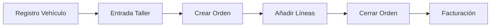

# CarLog - README Principal


## Descripción del Proyecto

CarLog es una plataforma **Full Stack** para la gestión integral de talleres mecánicos, diseñada con una arquitectura RESTful robusta y escalable [1](#0-0) . El sistema facilita el ciclo completo de vida de vehículos, desde su entrada en taller hasta la facturación final.

## Stack Tecnológico

| Componente | Tecnología |
|------------|------------|
| **Frontend** | Angular [2](#0-1)  |
| **Backend** | Spring Boot [3](#0-2)  |
| **Base de Datos** | MySQL [4](#0-3)  |
| **Seguridad** | JWT (JSON Web Token) [5](#0-4)  |
| **Despliegue** | Docker [6](#0-5)  |

## Estructura del Proyecto

```
CarLog/
├── backend/                 # Aplicación Spring Boot
│   └── src/main/java/com/carlog/backend/
│       └── BackendApplication.java
└──BBDD
|   └──docker-compose.yml  # Configuración Docker
└── README.md              # Esta documentación
```

## Inicio Rápido

### Prerrequisitos
- Docker y Docker Compose
- Java 17+ (para desarrollo local)

### Ejecución con Docker
```bash
# Clonar el repositorio
git clone https://github.com/JaviRSDEV/CarLog.git
cd CarLog

# Iniciar todos los servicios
docker-compose up -d
```

La aplicación estará disponible en:
- Frontend: `http://localhost:4200`
- Backend API: `http://localhost:8081/api`

## Documentación

- **[API Reference](./README.md)** - Documentación completa de endpoints REST
- **[Getting Started & Deployment](wiki)** - Guía detallada de configuración
- **[System Architecture](wiki)** - Arquitectura y patrones de diseño

## Roles del Sistema

CarLog soporta múltiples roles de usuario [7](#0-6) :
- **MANAGER**: Gestión completa del taller
- **MECHANIC**: Operaciones de reparación y diagnóstico
- **CLIENT**: Seguimiento de sus vehículos
- **DIY**: Entusiastas del bricolaje automotriz

## Flujo de Autenticación

1. **Registro**: `POST /api/auth/register` [8](#0-7) 
2. **Login**: `POST /api/auth/authenticate` [9](#0-8) 
3. **Uso**: Incluir token JWT en cabecera `Authorization: Bearer <token>` [10](#0-9) 

## Flujo de Trabajo Principal



## Licencia

Este proyecto está bajo licencia MIT - ver archivo [LICENSE](LICENSE) para detalles.

---

## Notes

Este README sirve como punto de entrada principal al proyecto CarLog. Para documentación técnica detallada de la API, endpoints específicos y ejemplos de uso, consulta el archivo [README.md](README.md) existente que contiene la referencia completa de la API REST del sistema.

Wiki pages you might want to explore:
- [CarLog Overview (JaviRSDEV/CarLog)](/wiki/JaviRSDEV/CarLog#1)

### Citations

**File:** README.md (L1-2)
```markdown
# CarLog
> **Plataforma Full Stack para la gestión integral de talleres mecánicos.** > Arquitectura RESTful robusta y escalable.
```

**File:** README.md (L4-4)
```markdown

```

**File:** README.md (L5-5)
```markdown

```

**File:** README.md (L6-6)
```markdown

```

**File:** README.md (L7-7)
```markdown

```

**File:** README.md (L18-18)
```markdown
| **Seguridad** | JWT (JSON Web Token) |
```

**File:** README.md (L24-24)
```markdown
Authorization: Bearer <tu_token_aqui>
```

**File:** README.md (L54-54)
```markdown
**URL**: /auth/register
```

**File:** README.md (L66-70)
```markdown
  "role": "MECHANIC" 
}
```

(Roles disponibles: MANAGER, MECHANIC, CLIENT, DIY)
```

**File:** README.md (L78-78)
```markdown
**URL**: /auth/authenticate
```

Tabla de Errores Comunes

| Código | Significado  | Causa probable                                | Solución                                        |
|--------|--------------|-----------------------------------------------|-------------------------------------------------|
| 403    | Forbidden    | Token inválido / No enviado / Login fallido   | Revisa la cabecera Authorization o credenciales |
| 404    | Not Found    | ID o Matrícula no existen                     | Verifica que el recurso existe en BD.           |
| 409    | Conflict     | Vehículo en otro taller / Matrícula duplicada | Realiza Check-out antes de Check-in             |
| 500    | Server Error | Error de lógica de negocio                    |                                                 |
